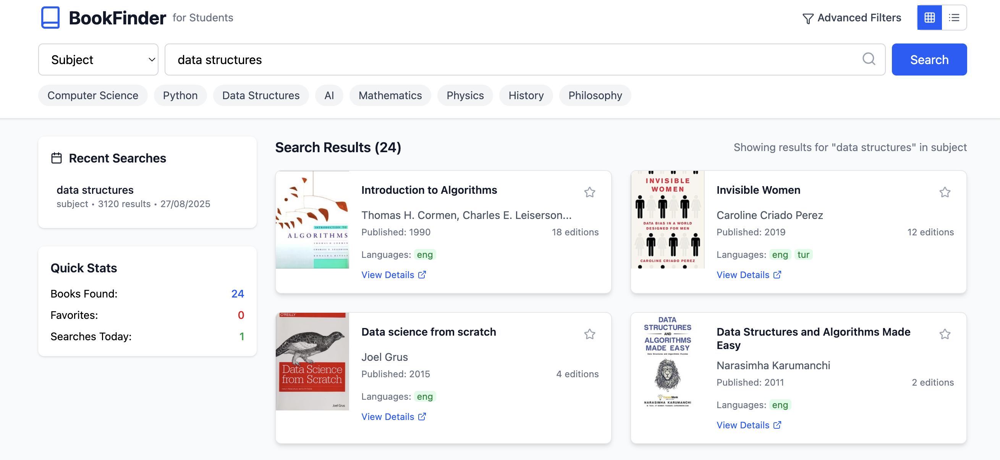

📚 BookFinder – for Students

BookFinder is a responsive book search application built with React + Tailwind CSS.
It connects with Open Library API to let students and book lovers search millions of books by title, author, subject, ISBN, and publisher.

✨ Features

🔍 Powerful Search – Search by title, author, subject, ISBN, or publisher

⚡ Quick Search – Predefined buttons for popular topics

🧭 Advanced Filters – Filter by year, language, and subject

❤️ Favorites – Mark books you like for easy access

📊 Quick Stats – Get insights on your searches and saved books

🕒 Search History – Quickly revisit past searches

📱 Responsive UI – Works smoothly on mobile, tablet, and desktop

🔄 Pagination – Navigate results page by page

📖 Grid/List Views – Toggle between book card grid or list layout

🖼️ Screenshots
Home Page - 

Search Results

🚀 Tech Stack

Frontend: React 19
, Tailwind CSS

UI Components: Lucide Icons

API: Open Library API

⚙️ Installation & Setup

Clone the repo and install dependencies:

# Clone repository
git clone https://github.com/Aryan-Kumar-7/book-finder.git

# Navigate into project
cd bookfinder

# Install dependencies
npm install

Start the development server:

npm run dev

Visit the app at http://localhost:5173
 (Vite default) or http://localhost:3000
 if using CRA/Next.js.

🛠️ Project Structure
bookfinder/
│── src/
│   ├── components/       # Reusable UI components
│   ├── pages/            # Page components
│   ├── App.jsx           # Main app component
│   └── index.jsx         # Entry point
│
├── public/               # Static assets
├── package.json
├── tailwind.config.js
└── README.md

🔑 Environment Variables

Create a .env file in the root directory and add:

VITE_OPEN_LIBRARY_API=https://openlibrary.org

(or adjust depending on your setup)

